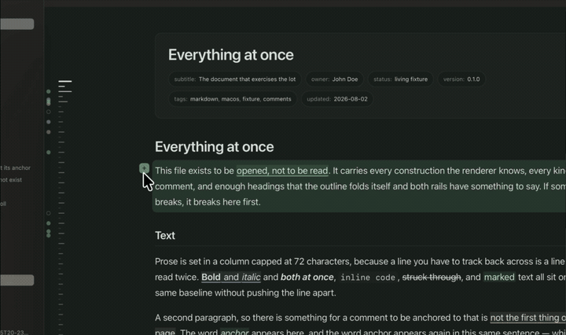
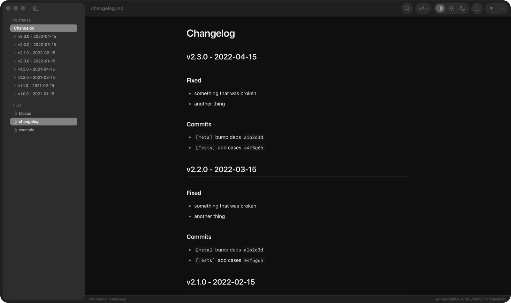
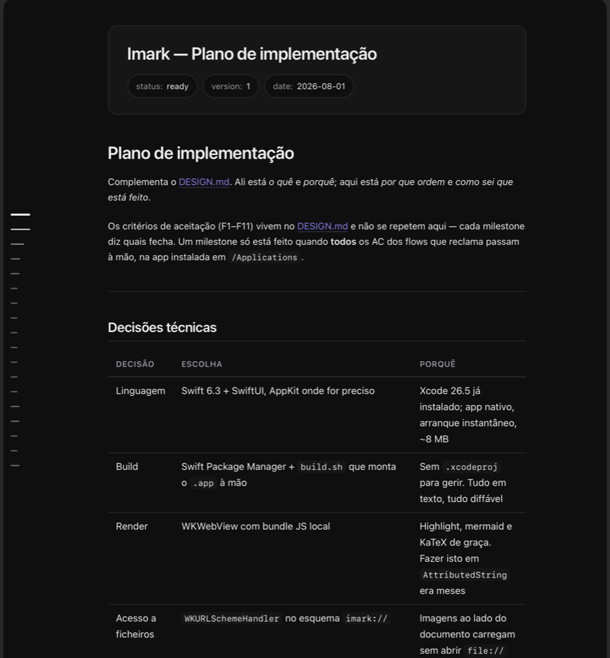
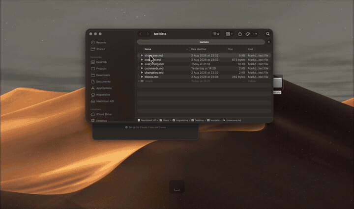
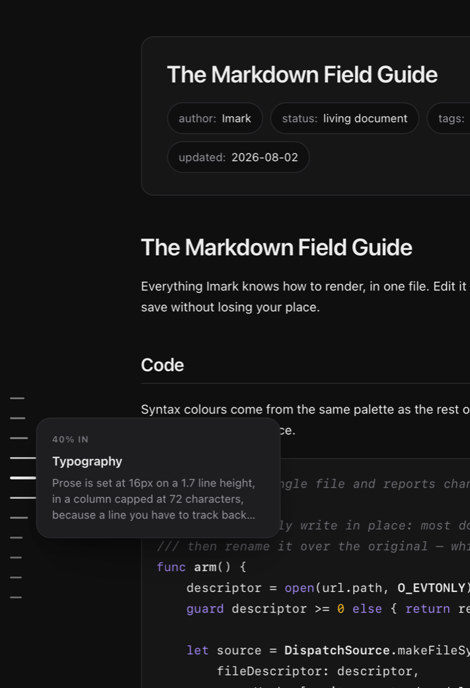
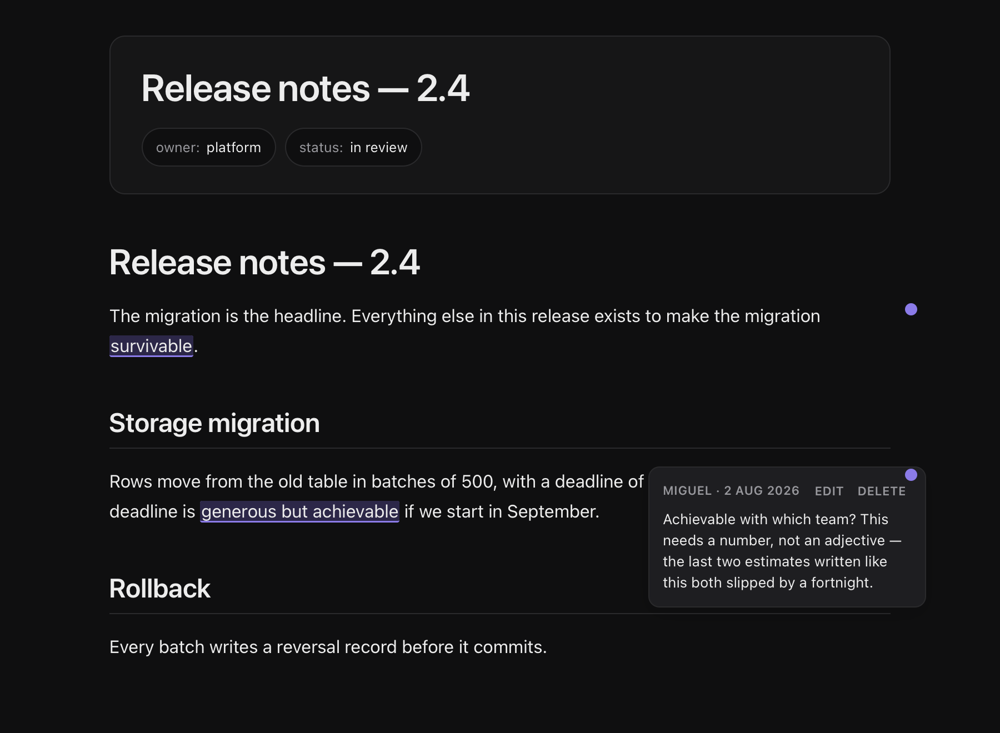
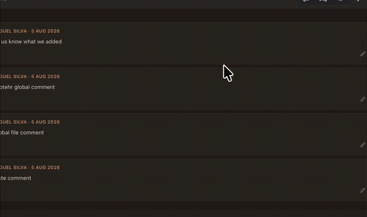

<p align="center">
  
</p>

<h1 align="center">Imark ®</h1>

<p align="center">
  <strong>Native Markdown reader for macOS.</strong><br><br>
  Double-click a <code>.md</code> file and it opens rendered, reloads itself while you<br>
  edit, and previews in the Finder with the space bar. Comment on a phrase and the<br>
  note goes into the file itself. Nothing leaves the machine.
</p>

<p align="center">
  
  
  
  
  
</p>

<p align="center">
  
</p>

<p align="center"><em>Comment on anything. The note goes into the <code>.md</code> file.</em></p>

> [!NOTE]
> Imark reads; it does not edit. Comments are the one thing it writes, and they go into the document itself — see [Comments](#comments). For everything else the *Open in* button hands the file to Cursor, VS Code, Sublime, Zed, or whatever else you have installed.

## Screenshots

| Document window | Quick Look preview |
|:---:|:---:|
|  |  |

Both are rendering [`testdata/showcase.md`](testdata/showcase.md). For the full
sweep — every construction, every kind of comment, and enough headings that the
outline folds itself — open [`testdata/everything.md`](testdata/everything.md).

<p align="center">
  
</p>

<p align="center"><em>Space bar in the Finder. No app to open first.</em></p>

### The outline rail

<p align="center">
  
</p>

Down the left edge of every document — in a window and in the Finder's preview
panel alike — sits one tick per heading. The marks taper around wherever you are
in the document, and around wherever you point, whichever is more recent: move
onto the rail and the funnel follows the pointer, so you can survey the whole
file without moving the page. A card names the section, quotes its first line,
and says whether anyone has commented on it. Click to jump, or press and drag to
scrub.

It exists because the preview panel has no room for a sidebar. It stayed in the
window because reading a long document and knowing where you are in it turn out
to be different jobs.

## Comments

<p align="center">
  
</p>

Select a phrase, press the speech bubble, write, press `↵`. The quoted words get
underlined, a dot appears in the margin, and clicking either opens the note. Pick
one of five colours while writing it, or change it later. The card carries **Edit**
and **Delete**, and `⌘Z` undoes any of it — writing, editing or deleting.

The note is stored **inside the `.md` file**, as an HTML comment:

```markdown
Rows move in batches of 500, and the deadline is generous but achievable.

<!-- imark quote="generous but achievable" by="john" at="2026-08-02T14:31Z"
Achievable with which team? This needs a number, not an adjective.
-->
```

Which means it travels with the document instead of living in a database only
this app can read:

| Where | What you see |
|---|---|
| **Imark** | the words underlined, a dot in the margin, the note on click |
| **Cursor, VS Code, Vim** | the block above, verbatim, right under the paragraph |
| **GitHub, any renderer** | nothing — HTML comments are invisible |
| **`grep`, `cat`** | the note, with the quote it refers to beside it |

The `quote=` is not only for the app. It is what makes the note legible in raw
text: someone opening the file in Vim can see what it refers to without counting
lines. If the quoted words are later edited away the note goes **orphan** — still
visible, still attached to its block, marked as having lost its anchor. There is
no fuzzy matching, because a note in the wrong place is worse than a note without
an exact one.

Four ways to get at them, because they answer different questions. The count in
the status bar opens **the list** — every note at once, out of the document, and
clicking one jumps to it. `⌘⇧C` opens them all **in place**, each under its own
block. `⌘'` and `⌘⇧'` **step** through one at a time. And a rail down the left
edge, outboard of the outline, marks **where** they are — placed where the notes
actually fall in the document, so three clustered in one section is visible at a
glance. Hovering a mark shows the note without going to it; clicking goes.

**File › Export Comments as Text…** writes a copy with every note turned into a
blockquote, for the review the other person has to read on GitHub:

```markdown
Rows move in batches of 500, and the deadline is generous but achievable.

> **john, 2 Aug 2026** on *“generous but achievable”*
>
> Achievable with which team? This needs a number, not an adjective.
```

A copy, not the document. HTML comments are the right home for a note between two
people who both use Imark, and useless for a review on the web; converting in
place would trade one for the other.

> [!IMPORTANT]
> This is the only feature that writes to your files. It writes to a temporary
> file and moves it into place, refuses to save at all if the document changed
> on disk since Imark read it, and keeps the last ten states of the document so
> `⌘Z` can put any of them back.

## Features

- **Comments in the file** — select, comment, edit or delete, and the note lives in the document as an HTML comment, so it survives being emailed, committed, or opened in anything else. `⌘Z` undoes any of it, and they export as visible blockquotes when the review has to happen on GitHub
- **Actions on a selection** — comment on it, translate it on device, or search the web for it in your default browser
- **Quick Look previews** — the space bar in the Finder renders the document, not raw text, using the same engine as the app
- **Live reload** — saving in your editor updates the view in under 300ms, keeping your scroll position, and it survives the delete-and-rename that editors call an atomic save
- **Foldable outline** — headings in the sidebar, with sections you can collapse; past twenty entries it opens folded, so a changelog is one row per version
- **Outline rail** — a tick per heading down the edge of every document, tapering around the pointer, with a card that names the section before you commit to going there
- **Wiki-links** — `[[note]]` resolves against the folder and opens in the same window, with back and forward history
- **The folder and the recents** — every `.md` beside the open document, plus the last five you opened from anywhere else
- **Everything GitHub-flavoured** — tables, task lists, footnotes, front matter as a header card, syntax highlighting, Mermaid diagrams, KaTeX maths
- **Find with a counter** — `⌘F` highlights every hit and tells you which one you are on
- **Offline where it counts** — documents render with every request blocked by a content security policy, KaTeX fonts embedded, remote images refused on purpose. The app's one network touch is asking GitHub once a day whether a newer version exists — a version number travels, nothing of yours does, and a switch in Settings turns it off
- **Tabs** — several documents in one window. ⌘-click a file in the sidebar to open it in a new tab, and everything macOS gives a tabbed app comes with it: `⌘⇧[` and `⌘⇧]`, drag a tab out to its own window, Merge All Windows
- **Native throughout** — real AppKit windows, menus, appearance switching and printing, around a WebView that only ever renders

## Tech Stack

- Swift 6 with AppKit, no external Swift dependencies
- WKWebView over a private `imark://` scheme, so images beside a document load without opening `file://` to the page
- markdown-it, highlight.js, Mermaid and KaTeX, bundled offline with esbuild
- Swift Package Manager plus a shell script that assembles the `.app` — no `.xcodeproj` to keep in sync

## Building from Source

Requires Xcode 16 or later and Node 20.

```bash
git clone https://github.com/migsilva89/imark.git
cd imark
cd renderer && npm install && cd ..
./build.sh
```

That builds the JavaScript bundle, compiles the Swift, assembles `Imark.app` and installs it to `/Applications`.

| | |
|---|---|
| `./build.sh` | build and install |
| `./build.sh --debug` | fast compile, for iterating |
| `./build.sh --no-install` | leave it in `dist/` |
| `IMARK_INSTALL_DIR=~/Applications ./build.sh` | install elsewhere |

## Keyboard Shortcuts

| | | | |
|---|---|---|---|
| `⌘O` | Open | `⌘F` | Find, prefilled with the selection |
| `⌘W` | Close window | `⌘G` / `⌘⇧G` | Next / previous hit |
| `⌘\` | Toggle sidebar | `←` / `→` | Fold / unfold outline section |
| `⌘[` / `⌘]` | Back / forward | `⌘R` | Reload |
| `⌘+` / `⌘-` / `⌘0` | Text size | `⌘⇧R` | Reveal in Finder |
| `⌘P` | Print or export PDF | `⌘⇧C` | Show all comments |
| `⌘'` / `⌘⇧'` | Next / previous comment | `⌘Z` | Undo the last comment change |
| `⌘/` | This table, in the app | | |

`⌘/` opens the same list inside the app, built by reading the menu bar rather
than from a copy of this table — which is also how it stays right on keyboards
where macOS remaps the keys. On a Portuguese layout, Back and Forward are `⌘Ç`
and `⌘~`, not `⌘[` and `⌘]`.

## FAQ

### How do I make Imark the default for `.md`?

Launch it with no document open and click **Make Imark the default for .md**, or use the same item in the **Imark** menu. Once it is the default, both quietly disappear.

### Why does the Quick Look extension need the network entitlement?

It does not use the network. WebKit refuses to start its WebContent process inside a sandboxed app extension without `com.apple.security.network.client`, even when every byte is served from a local scheme. The panel stays blank without it, with no error and no log entry.

### What does `⌘Z` undo?

The last change to the document — a note written, edited or deleted — up to ten
deep. Each one is a snapshot of the whole file taken before the change, which is
why undo behaves the same for all three. It only covers changes Imark made; edits
from your own editor are your editor's to undo.

### What happens if two people comment on the same words?

The second note gets an `nth="2"` so it anchors to the right occurrence. Notes on
the same paragraph stack down the margin rather than landing on top of each
other.

## Repository

```
Sources/Imark/           the app
Sources/ImarkQuickLook/  the Quick Look extension
Sources/ImarkRender/     the renderer both of them share
renderer/                JavaScript source
Resources/               build output — not edited by hand
Support/                 Info.plist, entitlements, generators, and tests
testdata/                documents that exercise the renderer
plugin/                  the Claude Code plugin — uses the app, is not part of it
```

The renderer is the only part that knows how to turn Markdown into anything. The Swift side handles windows, files and navigation, and talks to it in messages.

## Reviewing an agent's work

A plan from a coding agent is markdown. So is a diff, once it is wrapped in a
fenced block. Because comments live in the file, an agent can hand you a
document, you can annotate it in Imark, and the agent can read your notes back
out — with no server, no port and nothing installed on the other side. The file
is the whole bridge.

<p align="center">
  
</p>

<p align="center"><em>Request Changes, and the agent reads your notes back.</em></p>

[`plugin/`](plugin/README.md) is a Claude Code plugin that does exactly that:

```
/imark:imark-review PLAN.md       # review a markdown document
/imark:imark-notes PLAN.md        # notes you already left
```

Launched with no document, Imark offers to **set itself up for the coding
agents on your machine** — one skill, written into each one's `skills` folder.
The alert names every file before writing it, and undoing it is deleting those.
Claude Code and Codex read the same
`SKILL.md`, so it is the same file in both; only Claude Code also takes the two
loose commands.

Skills only, never a plugin: a plugin is not a folder of files but a registry
another program owns, and writing into that is how you break what somebody
already had. The `ExitPlanMode` hook is the one thing that needs the plugin.

A document under review gets two buttons in the toolbar — **Approve** and **Send
Back** — and pressing one ends the wait on the other side. They appear only on a
document that asked to be reviewed, marked `imark: review` in its front matter;
every other file opens exactly as it always did.

## Licences

Everything Imark bundles is permissive — MIT, ISC, BSD, Unlicense — with no
copyleft anywhere in the tree. Several of them require their copyright notice to
travel with the binary, so [`THIRD-PARTY.md`](THIRD-PARTY.md) is generated from
what esbuild actually put in the bundle, on every build, and the same list ships
inside the app: **Imark › About Imark** shows it.

Imark itself is [MIT](LICENSE) — use it, change it, redistribute it, just keep
the copyright notice.

## Tools

The icon is drawn in code from the rules in the design document:

```bash
swift Support/make-icon.swift
```

Comments are the one thing that writes to your documents, so the file surgery has
tests of its own:

```bash
swiftc -parse-as-library Sources/Imark/Comments.swift Sources/Imark/NoteColour.swift \
  Support/test-comments.swift -o /tmp/imark-test && /tmp/imark-test
node Support/test-export.mjs
swift Support/test-plus.swift
Support/test-review.sh
Support/test-setup.sh
```

Two helpers exist for looking at the UI without photographing the whole desktop — `Support/shoot.swift` renders a page in an off-screen web view, and `Support/window-id.swift` resolves a window id so a screenshot can be taken of one window:

```bash
screencapture -x -o -l"$(swift Support/window-id.swift Imark)" shot.png
```
